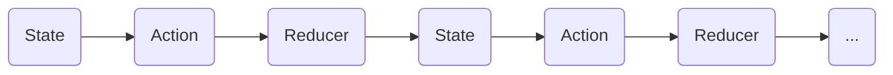

## Redux 

The redux word combine with two word Reducer and Flux

`View -> Action -> Reducer(s) -> Store -> View`

**Action:** Executing an action is called dispatching in Redux.

**Reducer:** A reducer is the next part in the chain of the unidirectional data flow. A reducer is a pure function

## Unidirectional data flow

In React, Unidirectional data flow describes a one-way data flow where the data can move in only one pathway when being transferred between different parts of the program.React, a Javascript library, uses unidirectional data flow. The data from the parent is known as props. You can only transfer data from parent to child and not vice versa. This means that the child components cannot update or modify the data on their own, makeing sure that a clean data flow architecture is followed. This also means that you can control the data flow better.

### React Components act with: Data Down, Action Up

* **Data Down:** The first and more simple concept, “data down,” refers to the passing of data and/or functions via props from parent to child components. These props are passed down when a child component gets created. We pass data down to child components so they can render them on to the DOM.

* **Action Up:** Action Up refers to sending data back up to the parent from the child component with the help of some action or event. Often these actions are connected to a callback function.

## Key principle of Redux

* State is an **immutable** object
* We **can't mutate** application state, we will always return a new modified state
* All state are initiate through **actions**
* Reducer take current state, action as arguments and return a new state
```js
    ((state, action) => newState)
```
* Redux is inspired from pure function and always inspired pure function
* Reducer are suppose to be pure and that's where the predictability comes from

## Unidirectional Data flow



## Read

* https://www.freecodecamp.org/news/redux-for-beginners-the-brain-friendly-guide-to-redux/
* https://www.robinwieruch.de/react-redux-tutorial/
* https://daveceddia.com/redux-tutorial/
* https://app.egghead.io/playlists/fundamentals-of-redux-course-from-dan-abramov-bd5cc867
* https://www.showrin.com/blog/learn-redux-by-building-redux


